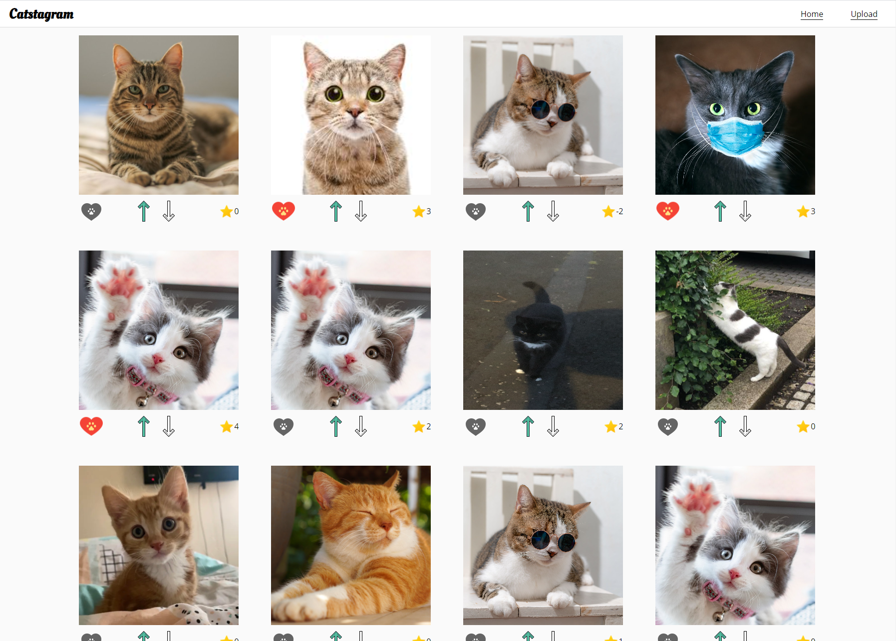

# Getting Started with Catstagram App

## Quick View

https://catstragram.netlify.app/#/

## Setup

In the project directory, you should run:

### `npm install`

First install the npm packages

### `npm start`

This will open the page at localhost:3000

### `npm test`

Run some of the tests I have written!

## Techniques used

- [scss](https://sass-lang.com/) to style the components
- [typeScript](https://www.typescriptlang.org/)
- [react-testing-library](https://testing-library.com/docs/react-testing-library/intro/) for testing along with Jest
- [axios](https://www.npmjs.com/package/axios) for making requests
- [react router](https://reactrouter.com/web/guides/quick-start) for creating routes
- [react-notification](https://www.npmjs.com/package/react-notifications) for the notifications

## Thoughts

Thank you for the test and for taking the time to review my application. It was very interesting and I even learned some new thing while doing it. It was my first time using TypeScript so hopefully you will not judge it too critically. Below I will give you some of my thoughts and reasoning for what I did and did not do.

### Tests

I didn't add too many tests in the end but just showed a general idea of how I would go about it which can be seen in the API folder and the Score component. If time permitted I would have added some end to end test to check that the buttons worked as expected with clicks and also the upload component.

### If there was more time

- Make a user and use the calls with the sub_id for that user.
- Add pagination for the images and call the api per the pagination page number.
- A mistake I made was that the UI waits for the API to return a change before updating creating a laggy user experience. I should have updated a local version of the state and then confirmed it changed in the API so that the user sees the changes immediately.
- The react-notification library was having troubles with TS which I could not figure out in time so I had to change the ImageUpload file to a javascript file to bypass the issue.
- The images may have some strange behaviors on iOS mobile that I should fix.
- I should add the APIKEY as an ENV variable on netlify when I deploy it rather than post it publicly on GitHub.

There's probably a lot more but those are the main points that I think would make the app more complete.

**_Thanks again for considering me for this role and I hope you enjoyed my solution!_**
